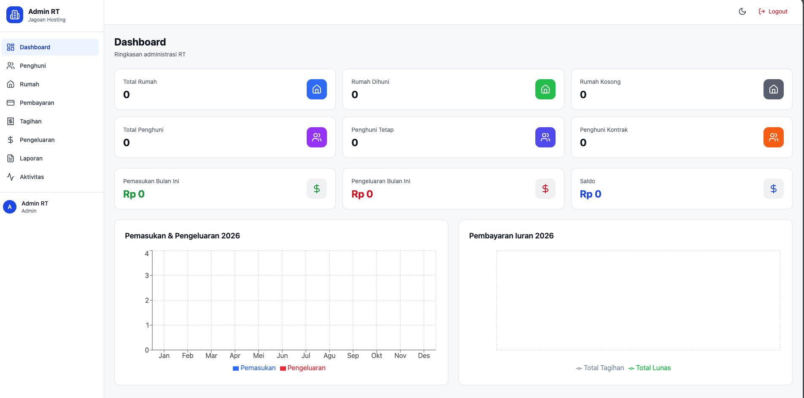
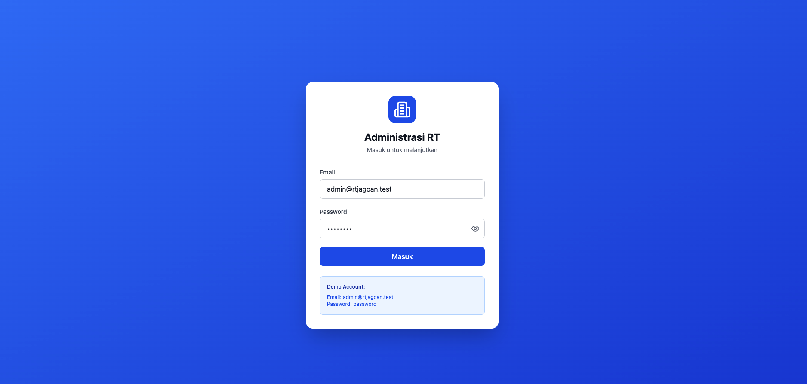
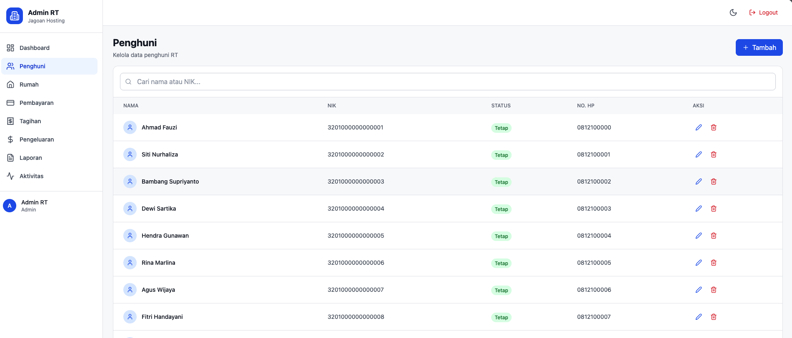
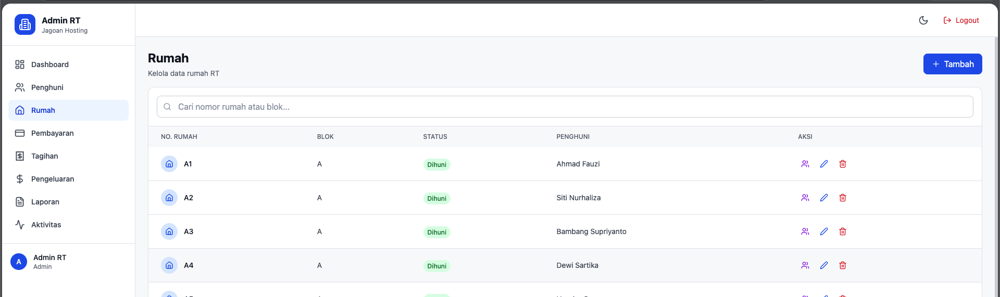
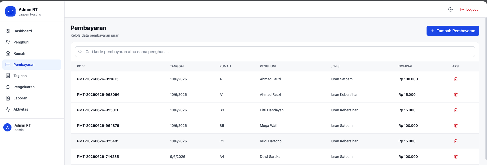
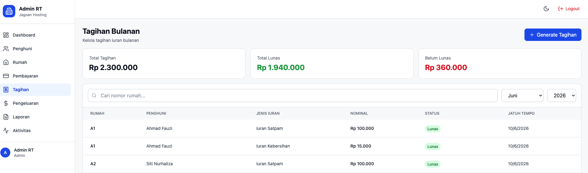
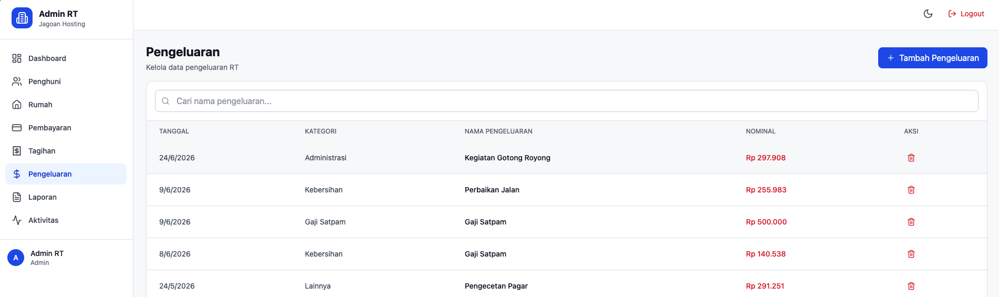
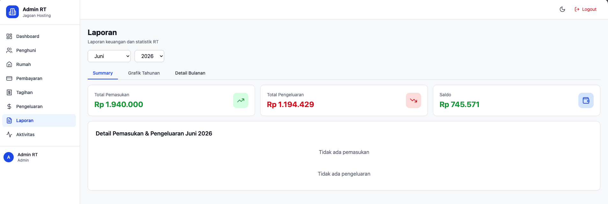
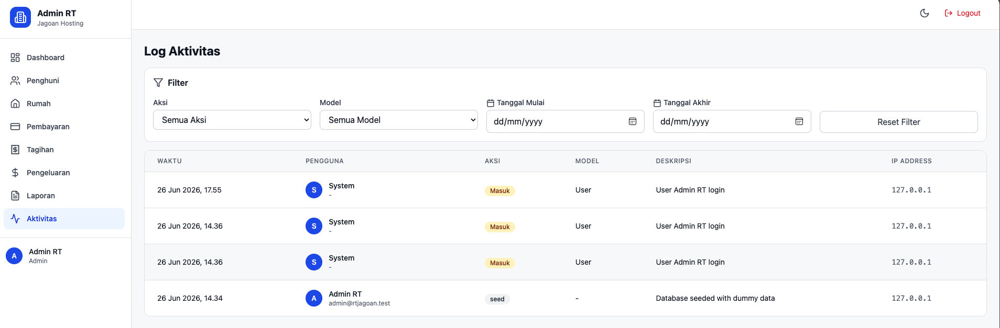

# Administrasi RT - Full Stack Application

Aplikasi web-based untuk mengelola administrasi RT (Rukun Tetangga) yang mencakup manajemen penghuni, rumah, pembayaran iuran, tagihan, pengeluaran, dan laporan keuangan.

## 📋 Fitur Utama

- **Dashboard** - Ringkasan statistik dan grafik keuangan
- **Manajemen Penghuni** - CRUD data penghuni (tetap & kontrak)
- **Manajemen Rumah** - CRUD data rumah dengan histori penghuni
- **Pembayaran** - Pencatatan pembayaran iuran bulanan
- **Tagihan** - Generate dan kelola tagihan bulanan
- **Pengeluaran** - Pencatatan pengeluaran RT
- **Laporan** - Laporan keuangan dengan chart
- **Log Aktivitas** - Tracking semua aktivitas pengguna

## 🛠️ Tech Stack

### Backend
- **Framework**: Laravel 12.x
- **Database**: SQLite
- **Authentication**: Laravel Sanctum
- **Architecture**: Repository Pattern + Service Layer

### Frontend
- **Framework**: React 18
- **Build Tool**: Vite
- **UI Library**: Tailwind CSS v4
- **Icons**: Lucide React
- **Routing**: React Router v6

## 📊 Entity Relationship Diagram (ERD)

```
┌─────────────────┐       ┌─────────────────┐       ┌─────────────────┐
│     users       │       │   residents     │       │     houses      │
├─────────────────┤       ├─────────────────┤       ├─────────────────┤
│ id (PK)         │       │ id (PK)         │       │ id (PK)         │
│ name            │       │ nik (unique)    │       │ nomor_rumah     │
│ email           │       │ nama_lengkap    │       │ blok            │
│ password        │       │ status          │       │ status          │
│ role            │       │ is_active       │       │ current_resident│
│ phone           │       │ tanggal_masuk   │       │ catatan         │
│ created_at      │       │ created_at      │       │ created_at      │
│ updated_at      │       │ updated_at      │       │ updated_at      │
└─────────────────┘       └─────────────────┘       └─────────────────┘
         │                         │                         │
         │                         │                         │
         │              ┌─────────────────┐                │
         │              │ house_resident  │                │
         │              │    (history)    │                │
         │              ├─────────────────┤                │
         │              │ id (PK)         │                │
         │              │ house_id (FK)   │────────────────┘
         │              │ resident_id (FK)│
         │              │ tanggal_masuk   │
         │              │ tanggal_keluar  │
         │              │ status          │
         │              │ catatan         │
         │              └─────────────────┘
         │
         │              ┌─────────────────┐       ┌─────────────────┐
         │              │  payments       │       │ payment_types   │
         │              ├─────────────────┤       ├─────────────────┤
         └─────────────│ id (PK)         │       │ id (PK)         │
                        │ kode_pembayaran │       │ nama            │
                        │ house_id (FK)   │───────│ nominal         │
                        │ resident_id (FK)│       │ slug            │
                        │ payment_type_id │       │ deskripsi       │
                        │ nominal         │       │ is_active       │
                        │ tanggal_bayar   │       │ created_at      │
                        │ metode_bayar    │       │ updated_at      │
                        │ status          │       └─────────────────┘
                        │ created_at      │
                        │ updated_at      │
                        └─────────────────┘
                                │
                                │              ┌─────────────────┐
                                │              │  monthly_bills  │
                                │              ├─────────────────┤
                                └─────────────│ id (PK)         │
                                               │ house_id (FK)   │
                                               │ payment_type_id │
                                               │ bulan           │
                                               │ tahun           │
                                               │ nominal         │
                                               │ status          │
                                               │ jatuh_tempo     │
                                               │ tanggal_lunas   │
                                               │ created_at      │
                                               │ updated_at      │
                                               └─────────────────┘

┌─────────────────┐       ┌─────────────────┐       ┌─────────────────┐
│  expenses       │       │ expense_categories│     │ activity_logs   │
├─────────────────┤       ├─────────────────┤       ├─────────────────┤
│ id (PK)         │       │ id (PK)         │       │ id (PK)         │
│ category_id (FK)│───────│ nama            │       │ user_id (FK)    │
│ nama_pengeluaran│       │ slug            │       │ action          │
│ nominal         │       │ is_active       │       │ module          │
│ tanggal         │       │ created_at      │       │ description     │
│ keterangan      │       │ updated_at      │       │ subject_type    │
│ created_by      │       └─────────────────┘       │ subject_id      │
│ created_at      │                                 │ old_data        │
│ updated_at      │                                 │ new_data        │
└─────────────────┘                                 │ ip_address      │
                                                    │ user_agent      │
                                                    │ created_at      │
                                                    │ updated_at      │
                                                    └─────────────────┘
```

### Relasi Database

1. **users** ↔ **residents** - Tidak langsung, user adalah admin
2. **houses** ↔ **residents** - Many-to-Many melalui `house_resident` (histori)
3. **houses** → **residents** - One-to-One (current_resident_id)
4. **payments** → **houses** - Many-to-One
5. **payments** → **residents** - Many-to-One
6. **payments** → **payment_types** - Many-to-One
7. **monthly_bills** → **houses** - Many-to-One
8. **monthly_bills** → **payment_types** - Many-to-One
9. **expenses** → **expense_categories** - Many-to-One
10. **activity_logs** → **users** - Many-to-One

## 📁 Struktur Project

```
Jagoan-Hosting/
├── backend/                 # Laravel Backend
│   ├── app/
│   │   ├── Http/
│   │   │   └── Controllers/
│   │   │       └── Api/     # API Controllers
│   │   ├── Models/          # Eloquent Models
│   │   ├── Repositories/    # Repository Pattern
│   │   │   ├── Contracts/   # Interfaces
│   │   │   └── *.php        # Implementations
│   │   ├── Services/        # Business Logic
│   │   └── Providers/       # Service Providers
│   ├── database/
│   │   ├── migrations/      # Database Migrations
│   │   └── seeders/         # Database Seeders
│   ├── routes/
│   │   └── api.php          # API Routes
│   └── storage/             # File Storage
│
├── frontend/                # React Frontend
│   ├── src/
│   │   ├── components/      # Reusable Components
│   │   │   └── AppLayout.jsx
│   │   ├── pages/           # Page Components
│   │   │   ├── DashboardPage.jsx
│   │   │   ├── ResidentsPage.jsx
│   │   │   ├── HousesPage.jsx
│   │   │   ├── PaymentsPage.jsx
│   │   │   ├── BillsPage.jsx
│   │   │   ├── ExpensesPage.jsx
│   │   │   ├── ReportsPage.jsx
│   │   │   └── ActivityLogsPage.jsx
│   │   ├── App.jsx          # Main App Component
│   │   └── main.jsx         # Entry Point
│   └── public/              # Static Assets
│
└── image/                   # Screenshots
    ├── dashboard.png
    ├── login.png
    ├── penghuni.png
    ├── rumah.png
    ├── pembayaran.png
    ├── tagihan.png
    ├── pengeluaran.png
    ├── laporan.png
    └── aktifitas.png
```

## 🚀 Panduan Instalasi

### Prerequisites

Pastikan sistem Anda memiliki:
- **PHP** >= 8.2
- **Composer** >= 2.0
- **Node.js** >= 16.x
- **NPM** >= 8.x
- **SQLite** (sudah terinstall di macOS)

### 1. Clone Repository

```bash
git clone https://github.com/nandasafiqalfiansyah/Administrasi-RT-Full-Stack-Application.git
cd Administrasi-RT-Full-Stack-Application
```

### 2. Setup Backend (Laravel)

```bash
# Masuk ke direktori backend
cd backend

# Install dependencies
composer install

# Copy file environment
cp .env.example .env

# Generate application key
php artisan key:generate

# Buat database SQLite
touch database/database.sqlite

# Jalankan migrasi dan seeder
php artisan migrate --seed

# Install Laravel Sanctum (jika belum)
composer require laravel/sanctum
php artisan vendor:publish --provider="Laravel\Sanctum\SanctumServiceProvider"
php artisan migrate
```

### 3. Setup Frontend (React)

```bash
# Dari root project, masuk ke direktori frontend
cd ../frontend

# Install dependencies
npm install
```

### 4. Konfigurasi Environment

#### Backend (.env)
```env
APP_NAME="Administrasi RT"
APP_ENV=local
APP_KEY=base64:GENERATED_KEY
APP_DEBUG=true
APP_URL=http://localhost:8000

LOG_CHANNEL=stack
LOG_LEVEL=debug

DB_CONNECTION=sqlite
DB_DATABASE=database/database.sqlite

BROADCAST_DRIVER=log
CACHE_DRIVER=file
FILESYSTEM_DISK=local
QUEUE_CONNECTION=sync
SESSION_DRIVER=file
SESSION_LIFETIME=120

SANCTUM_STATEFUL_DOMAINS=localhost:5173
```

#### Frontend (.env)
```env
VITE_API_URL=http://localhost:8000/api
```

### 5. Menjalankan Aplikasi

#### Terminal 1 - Backend Server
```bash
cd backend
php artisan serve --host=0.0.0.0 --port=8000
```

#### Terminal 2 - Frontend Server
```bash
cd frontend
npm run dev
```

### 6. Akses Aplikasi

- **Frontend**: http://localhost:5173
- **Backend API**: http://localhost:8000/api
- **Default Credentials**:
  - Email: `admin@rt.com`
  - Password: `password`

## 📸 Screenshots

### Dashboard

*Halaman dashboard menampilkan ringkasan statistik, grafik pemasukan/pengeluaran, dan status keuangan RT*

### Login

*Halaman login untuk autentikasi pengguna*

### Manajemen Penghuni

*Halaman kelola data penghuni RT dengan status tetap dan kontrak*

### Manajemen Rumah

*Halaman kelola data rumah dengan informasi penghuni saat ini*

### Pembayaran

*Halaman pencatatan dan riwayat pembayaran iuran*

### Tagihan

*Halaman generate dan kelola tagihan bulanan*

### Pengeluaran

*Halaman pencatatan pengeluaran RT*

### Laporan

*Halaman laporan keuangan dengan visualisasi chart*

### Log Aktivitas

*Halaman tracking log aktivitas semua pengguna*

## 🔧 Troubleshooting

### Error: "Class 'ActivityLog' not found"
```bash
# Jalankan ulang migrasi
cd backend
php artisan migrate:fresh --seed
```

### Error: "No such function: MONTH" (SQLite)
Sudah diperbaui dengan menggunakan `strftime()` untuk kompatibilitas SQLite.

### Port sudah digunakan
```bash
# Ganti port backend
php artisan serve --port=8001

# Ganti port frontend
npm run dev -- --port 5174
```

### Permission denied pada storage
```bash
chmod -R 775 backend/storage
chmod -R 775 backend/bootstrap/cache
```

## 📝 Catatan Penting

1. **Database**: Menggunakan SQLite untuk kemudahan development. Untuk production, disarankan menggunakan MySQL/PostgreSQL.
2. **Authentication**: Menggunakan Laravel Sanctum dengan token-based authentication.
3. **File Upload**: Fitur upload bukti bayar dan nota tersedia namun belum diimplementasi di frontend.
4. **Pagination**: Semua data menggunakan pagination dengan 10 item per halaman.
5. **Dark Mode**: Frontend sudah mendukung dark mode.

## 🤝 Kontribusi

1. Fork repository
2. Buat branch baru (`git checkout -b feature/AmazingFeature`)
3. Commit perubahan (`git commit -m 'Add some AmazingFeature'`)
4. Push ke branch (`git push origin feature/AmazingFeature`)
5. Buka Pull Request

## 📄 License

Distributed under the MIT License. See `LICENSE` for more information.

## 👨‍💻 Developer

**Nanda Safiq Alfiansyah**
- GitHub: [@nandasafiqalfiansyah](https://github.com/nandasafiqalfiansyah)
- Repository: [Administrasi-RT-Full-Stack-Application](https://github.com/nandasafiqalfiansyah/Administrasi-RT-Full-Stack-Application)

## 📞 Support

Untuk pertanyaan atau masalah, silakan buat issue di repository GitHub.

---

**© 2026 Administrasi RT. All rights reserved.**